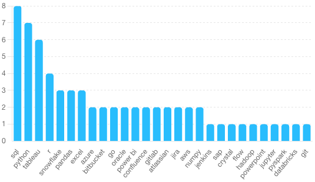

# Introduction
Discover the data job market! This project examines data analyst roles, revealing top-paying jobs, in-demand skills, and where high demand meets high salaries in data analytics.

SQL queries -> :[project_sql](/project_sql/)

# Background
Motivated by a need to better understand the data analyst job market, this project aims to identify high-paying jobs and in-demand skills, making it easier for others to find the best opportunities.

Data collected from [Luke Barousse](https://drive.google.com/drive/folders/1moeWYoUtUklJO6NJdWo9OV8zWjRn0rjN). It is filled with insights on job titles, salaries, locations, and essential skills.

### The questions I wanted to answer through my SQL queries were:

1. What are the top-paying data analyst jobs?
2. What skills are required for these top-paying jobs?
3. What skills are most in demand for data analysts?
4. Which skills are associated with higher salaries?
5. What are the most optimal skills to learn?

# Tools I Used
For an in-depth exploration of the data analyst job market, I utilized several essential tools:

- **SQL:** The core of my analysis, enabling me to query the database and extract crucial insights.

- **PostgreSQL:** The database management system I selected, perfect for managing job posting data.

- **Visual Studio Code:** My preferred tool for managing the database and executing SQL queries.

- **Git & GitHub:** Crucial for version control and sharing SQL scripts and analysis, ensuring collaboration and project tracking.

# The Analysis
Each query in this project was designed to investigate specific aspects of the data analyst job market. Here’s my approach for each question:

### 1. Top paying Data Analyst Jobs

```sql
SELECT
    job_id,
    job_title,
    job_location,
    job_schedule_type,
    salary_year_avg,
    job_posted_date,
    name AS company_name
FROM
    job_postings_fact
LEFT JOIN company_dim ON job_postings_fact.company_id = company_dim.company_id
WHERE
    job_title_short = 'Data Analyst' AND
    job_location = 'Anywhere' AND
    salary_year_avg IS NOT NULL
ORDER BY
    salary_year_avg DESC
LIMIT 10
```

Here's the breakdown of the top data analyst jobs in 2023:
- **Wide Salary Range:** The top 10 highest-paying data analyst roles range from $184,000 to $650,000, highlighting significant salary potential in the field.
- **Diverse Employers:** Companies such as SmartAsset, Meta, and AT&T offer high salaries, demonstrating strong demand across various industries.
- **Job Title Variety:** There is a wide range of job titles, from Data Analyst to Director of Analytics, showcasing the diverse roles and specializations within data analytics.


### 2.
To identify the skills required for top-paying jobs, I combined job postings with skills data, offering insights into what employers prioritize for high-compensation roles.

```sql
WITH top_paying_jobs AS (
    SELECT
        job_id,
        job_title,
        salary_year_avg,
        name AS company_name
    FROM
        job_postings_fact
    LEFT JOIN company_dim ON job_postings_fact.company_id = company_dim.company_id
    WHERE
        job_title_short = 'Data Analyst' AND
        job_location = 'Anywhere' AND
        salary_year_avg IS NOT NULL
    ORDER BY
        salary_year_avg DESC
    LIMIT 10
)

SELECT
    top_paying_jobs.*,
    skills
FROM top_paying_jobs
INNER JOIN skills_job_dim ON top_paying_jobs.job_id = skills_job_dim.job_id
INNER JOIN skills_dim ON skills_job_dim.skill_id = skills_dim.skill_id
ORDER BY
    salary_year_avg DESC
```

Here's the breakdown of the most in-demand skills for the top 10 highest paying data analyst jobs in 2023:

- SQL: Leading with a strong presence, required in 8 out of 10 top roles.
- Python: Close behind, needed in 7 of these positions.
- Tableau: Also highly sought after, mentioned in 6 roles.
- Other Skills: R, Snowflake, Pandas, and Excel show varying degrees of demand.


### 3.
This query revealed the skills most commonly requested in job postings, guiding attention to areas with high demand.
```sql
SELECT
    skills,
    COUNT(skills_job_dim.job_id) AS demand_count
FROM job_postings_fact
INNER JOIN skills_job_dim ON job_postings_fact.job_id = skills_job_dim.job_id
INNER JOIN skills_dim ON skills_job_dim.skill_id = skills_dim.skill_id
WHERE
    job_title_short = 'Data Analyst' AND
    job_work_from_home = True
GROUP BY
    skills
ORDER BY
    demand_count DESC
LIMIT 5
```
Here's the breakdown the most in-demand skill for data analysts in 2023.
- Top Skill: SQL is the most in-demand skill with a demand count of 7,291.
- Other Key Skills: Excel and Python follow with demand counts of 4,611 and 4,330, respectively.
- Additional Important Skills: Tableau and Power BI also show significant demand with counts of 3,745 and 2,609, respectively.

### Most In-Demand Data Analyst Skills in 2023

| Skills    | Demand Count |
|-----------|--------------|
| SQL       | 7291         |
| Excel     | 4611         |
| Python    | 4330         |
| Tableau   | 3745         |
| Power BI  | 2609         |


### 4
Analyzing the average salaries associated with different skills highlighted which skills command the highest pay.

```sql
SELECT
    skills,
    ROUND(AVG(salary_year_avg), 0) AS avg_salary
FROM job_postings_fact
INNER JOIN skills_job_dim ON job_postings_fact.job_id = skills_job_dim.job_id
INNER JOIN skills_dim ON skills_job_dim.skill_id = skills_dim.skill_id
WHERE
    job_title_short = 'Data Analyst'
    AND salary_year_avg IS NOT NULL
    AND job_work_from_home = True
GROUP BY
    skills
ORDER BY
    avg_salary DESC
LIMIT 25
```

- **High Demand for Specialized Skills:** Skills like PySpark, Bitbucket, and DataRobot command top salaries, reflecting their critical roles in big data processing, version control, and automated machine learning.

- **Value of Foundational Data Science Tools:** Proficiency in widely-used libraries and tools such as Jupyter, Pandas, and NumPy offers competitive compensation, emphasizing the importance of core data analysis skills.

- **Advantage of Diversified Technical Expertise:** Knowledge in diverse areas, including cloud platforms (Databricks, GCP), programming languages (Golang), and specialized platforms (Couchbase, Watson), provides a salary advantage, showcasing the benefit of a broad technical skill set in the data industry.

Here is a breakdown of the average salaries for the top paying skills for data analysts:

| Skill         | Average Salary ($) |
|---------------|-------------------|
| PySpark       | 208,172           |
| Bitbucket     | 189,155           |
| Couchbase     | 160,515           |
| Watson        | 160,515           |
| DataRobot     | 155,486           |
| GitLab        | 154,500           |
| Swift         | 153,750           |
| Jupyter       | 152,777           |
| Pandas        | 151,821           |
| Elasticsearch | 145,000           |
| Golang        | 145,000           |
| NumPy         | 143,513           |
| Databricks    | 141,907           |
| Linux         | 136,508           |
| Kubernetes    | 132,500           |
| Atlassian     | 131,162           |
| Twilio        | 127,000           |
| Airflow       | 126,103           |
| Scikit-learn  | 125,781           |
| Jenkins       | 125,436           |
| Notion        | 125,000           |
| Scala         | 124,903           |
| PostgreSQL    | 123,879           |
| GCP           | 122,500           |
| MicroStrategy | 121,619           |

This table lists the top paying skills along with their corresponding average salaries.

### 5
By combining insights from demand and salary data, this query aimed to identify skills that are both in high demand and offer high salaries, providing a strategic focus for skill development.

```sql
SELECT
    skills_dim.skill_id,
    skills_dim.skills,
    COUNT(skills_job_dim.job_id) AS demand_count,
    ROUND(AVG(job_postings_fact.salary_year_avg), 0) AS avg_salary
FROM job_postings_fact
INNER JOIN skills_job_dim ON job_postings_fact.job_id = skills_job_dim.job_id
INNER JOIN skills_dim ON skills_job_dim.skill_id = skills_dim.skill_id
WHERE
    job_title_short = 'Data Analyst'
    AND salary_year_avg IS NOT NULL
    AND job_work_from_home = TRUE
GROUP BY
    skills_dim.skill_id
HAVING
    COUNT(skills_job_dim.job_id) > 10
ORDER BY
    avg_salary DESC,
    demand_count DESC
LIMIT 25;
```
- **High Demand and Competitive Salaries:** Python and Tableau show the highest demand counts (236 and 230 respectively) with average salaries just above $100,000. These skills are fundamental for data analysts, making them highly valuable for career growth.

- **Emerging Technologies with High Salaries:** Skills like Go, Confluence, and Hadoop have moderate to high demand and offer average salaries over $113,000. These technologies are becoming increasingly important in the data industry, making them good targets for skill development.

- **Cloud and Data Warehousing Skills:** Snowflake, Azure, and AWS are highly demanded, with salaries ranging from $108,317 to $112,948. As cloud computing and data warehousing continue to grow, these skills are essential for modern data infrastructure management.


| Skill ID | Skill       | Demand Count | Average Salary ($) |
|----------|-------------|--------------|--------------------|
| 1        | Python      | 236          | 101,397            |
| 182      | Tableau     | 230          | 99,288             |
| 5        | R           | 148          | 100,499            |
| 186      | SAS         | 63           | 98,902             |
| 7        | SAS         | 63           | 98,902             |
| 185      | Looker      | 49           | 103,795            |
| 80       | Snowflake   | 37           | 112,948            |
| 79       | Oracle      | 37           | 104,534            |
| 61       | SQL Server  | 35           | 97,786             |
| 74       | Azure       | 34           | 111,225            |

Top 10 Optimal Skills to Learn

# What I learned
Throughout this journey, I have significantly enhanced my SQL skills with the following:

- **Complex Queries:** Mastered advanced SQL techniques, efficiently joining tables and using WITH clauses for temporary table operations.

- **Data Aggregation:** Proficiently used GROUP BY and aggregate functions like COUNT() and AVG() to summarize data effectively.

- **Analytical Skills:** Improved my problem-solving abilities, transforming questions into actionable and insightful SQL queries.


# Conclusions
From the analysis, several key insights emerged:

- Top-Paying Data Analyst Jobs: Remote data analyst roles offer a wide salary range, with the highest reaching up to $650,000.
- Skills for Top-Paying Jobs: Advanced proficiency in SQL is crucial for high-paying data analyst positions, making it a critical skill for top salaries.
- Most In-Demand Skills: SQL is the most demanded skill in the data analyst job market, essential for job seekers.
- Skills with Higher Salaries: Specialized skills such as SVN and Solidity command the highest average salaries, highlighting the value of niche expertise.
- Optimal Skills for Job Market Value: SQL stands out for both high demand and substantial average salary, making it one of the most valuable skills for data analysts to learn to maximize their market value.
